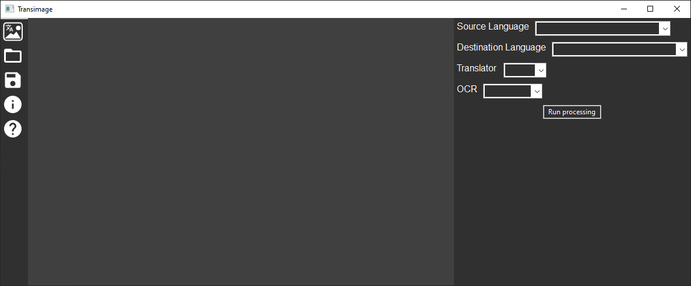
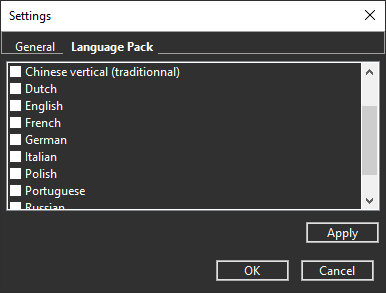

# Transimage

An image translator that can use 3 translators (Google, Bing and DeepL) 
and two OCR ([Tesseract](https://github.com/tesseract-ocr) and [EasyOCR](https://github.com/JaidedAI/EasyOCR)). 
Text editing is also possible but only in the original language of the image.

**At the moment the Google translator does not work because of this [issue](https://github.com/ssut/py-googletrans/issues/234).**

I wrote this [package](https://github.com/A2va/ImageTranslator) for translating and detecting text on images




## Usage

Before to use this programm you need to download the desired language package in the settings and click on apply.



1. Open Image
2. Select source and destination language then translator and OCR
3. Click on "Run processing"

### Edition

*  Ctrl+Scroll zoom in and out
* Shift+Ctrl+Scroll move left and right
* Scroll move up and down
* Edit text with a double click on it

4. When your finished your edition you can save the image

## Roadmap

If I have time I will implement this

* Custom font
* Detecting text color
* Inpainting and for a replace of white rectangle

## Development

```
git clone https://github.com/A2va/Transimage.git
python -m pip install -r requirements.txt
python -m pip install torch==1.7.0+cpu torchvision==0.8.1+cpu -f https://download.pytorch.org/whl/torch_stable.html
```
### Build

```
python setup.py build
```


